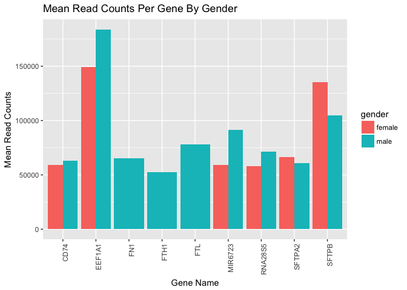
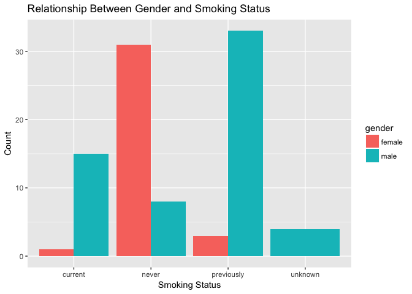

Analysis Report 2: Your Title Here
================
Charlotte Lopp
November 10, 2017

Introduction
============

In the 1950s, tobacco companies, with their ingenious advertisements promoting the idea that the quintessence of cool and glamour was or was at least very closely linked to cigarette smoking, started a trend that would change lives for decades. Hollywood icons, screen beauties, and even presidents were smoking and by the late 1950s around half of the population of industrialized nations smoked. The tobacco industry seemed untouchable and unstoppable but it all changed in 1994 when Diane Castano, whose husband died of lung cancer, sued the tobacco industry in the largest potential class action suit in history. Ever since, efforts have been made to expose not only the individual dangers of smoking but also the consequential dangers suffered by those who didn't decide to smoke - secondhand smoking, a concept championed by California politicians. Passive or indirect smoking may be one of the causal factors for lung cancer; it would explain the long-standing riddle of why many women (whose husbands were heavy smokers) develop lung cancer even though they themselves are non-smokers (Hirayama, 2000).

Lung cancer is a leading cause of cancer-related death worldwide and one of the most common cancers in humans (Jemal *et al.*, 2011). With the introduction of low-dose computerized tomography screening, early stage diagnosis is slowly increasing but lung cancer remains a devastating disease that has a very poor prognosis (Team and others, 2011). Non-small cell lung cancer (NSCLC) is the most common type of lunch cancer (Navada *et al.*, 2006) and accounts for approximately 85% of lung cancer cases in the USA (Sher *et al.*, 2008). Adenocarcinoma is currently the most common type of NSCLC in Asian and North American patients and accounts for 30% of primary lung cancer in male smokers and 40% in female smokers in the USA (Seo *et al.*, 2012). Smoking is the most prevalent risk factor for lung cancer, and the risk increases with the length of time and number of cigarettes people smoked (Powell *et al.*, 2013). Research within the last decade has revealed differences in molecular characteristics of lung cancers in smokers versus nonsmokers, suggesting distinct pathogenic mechanism (Sun *et al.*, 2007). Cheng et al. found that overall gene expression levels were lower in smoker with lung cancer compared with healthy smokers in general (Cheng *et al.*, 2012); Beane et al. found around 200 genes differentially expressed between eight smokers with lung cancer and five smoking healthy controls (Beane *et al.*, 2011); Han et al. identified 1063 genes that wee differentially expressed between tumor and normal tissues in smoking patients including SPP1, TOP2A, and CRABP2, etc (Han *et al.*, 2014). Despite all of them being valuable in adding literature and candidate genes in the collaborative study of lung cancer, non of them focused on identifying differences in gene expression profile between smokers and nonsmokers with lung cancer. Its the Seo et al. study in 2012 that looked at smokers and nonsmokers and utilized a hierarchical clustering method to identify cancer-up, cancer-down, and mixed regulated genes for each patient with extremely overexpressed genes also detected (Seo *et al.*, 2012).

RNA-seq analysis provides us with a revolutionary tool for transcriptome analysis and with a novel opportunity to address such inquiries such a differences in gene expression profiles between smoking and nonsmoking patients (Wang *et al.*, 2009). RNA-seq offers several key advantages over existing technologies: 1) unlike hybridization-based approaches, RNA-seq is not limited to detecting transcripts that correspond to existing genomic sequence (which makes it particularly attractive for non-model organisms with genomic sequences that are yet to be determined); 2) RNA-seq has very low, if any, background signal because DNA sequences can be unambiguously mapped to unique regions of the genome; 3) the results of RNA-seq also show high levels of reproducibility, for both technical and biological replicates; and 4) because there are no cloning steps, and with the Helicos technology there is no amplication step, RNA-seq requires less RNA sample (Wang *et al.*, 2009). Thus, using this powerful tool, Li et al. performed a large scale transcriptome analysis to identify the genes with altered expression in lung cancer development.

Methods
=======

Sample origin and sequencing
----------------------------

In 2012, Seo et al. conducted transcriptome analysis of lung adenocarcinoma in order to identify the somatic mutations and transcriptional variations associated with lung cancer (Seo *et al.*, 2012). They collected 200 fresh surgical specimens of primary lung adenocarcinoma from Korean patients who underwent major lunch resection and recorded diagnosis, gender, cancer stage, and smoking status for each patient. Among these 200 cancer patients, 54.5% (n = 109) were females and 58.0% (n = 116) were never-smokers. Of these, 87 cancer tissues whose driver mutations were not detected by screening tests were analyzed by transcriptome sequencing combined with whole-exome (n = 76) and transcriptome (n = 77) seuqencing of matched normal lung tissue samples. Transcriptome sequencing was a powerful method to use for detecting driver mutations in cancer, since not only somatic point mutations but also aberrant RNA variants such as fusion genes and alternative splicing can be examined. All these sequencing experiments were done as described previously. They generated 14,038,673,860 paired-end 101-bp-long reads from RNA sequencing of 164 samples (87 cancer and 77 corresponding normal tissues). On average, the RNA sequencing throughputs were 9.77 and 7.38 Gbp for cancer and normal tissues, respectively. In the whole-exome sequencing of normal tissues, they obtained 32.96-fold read depth per tissue for regions targeted by the exome capture platform used in this study.

Li et al. (Li *et al.*, 2015) downloaded Seo et al.'s RNA-seq data from paired normal and tumor tissues from 34 nonsmoking and 34 smoking patients with lung adenocarcinoma (<GEO:GSE40419>). They aimed to perform a large scale transcriptome analysis and identify the genes with altered expression in lung cancer development. They also looked for differences in gene expression profiles between smoking and nonsmoking patients in order to better define the impact of smoking in lung cancer development and provide insights that might better individualize treatment strategies for the patients.

Computational
-------------

After obtaining the RNA-seq data, Li et al. applied a stringent filter on the data to remove the gene tags with sparse count data. They then used edgeR to identify the genes differently expressed between tumor and normal tissues as well as the genes that varied between nonsmoker and smoker patients. The GLM model in edgeR allowed them to identify the genes that varied between nonsmoker and smoker patients with lung adenocarcinmoa. They identified 175 genes whose expressions were statistically different between nonsmoker and smoker group. For our use of the data, biomartr (Drost and Paszkowski, 2017) was used to implement straightforward functions for bulk retrieval of all genomci data for the selected files present in databases hosted by the National Center for Biotechnology Information (NCBI) and European Bioinformatics Institute (EMBL-EBI). Trimmomatic (Bolger *et al.*, 2014) was used to handle the paired-end data as it was specifically developed to be a more flexible and efficient preprocessing tool. Sailfish (Patro *et al.*, 2014), which is a computational methd for quantifying the abundance of previously annotated RNA isoforms from RNA-seq data, was used because it provides quantification estimates much faster than other existing approaches without loss of accuracy. It exemplifies the potential of lightweight algorithms for efficiently processing sequencing reads by facilitating frequent reanalysis of data and reduicng the need to optimize parameters

Results
=======

In addition to a minimum of 4-5 figures/tables (and associated captions), you should include sufficient text in this section to describe what your findings were. Remember that in the results section you just describe what you found, but you don't interpret it - that happens in the discussion.

    ## Warning: package 'dplyr' was built under R version 3.4.2

    ## Warning: package 'tidyr' was built under R version 3.4.2

| gender | genename |  mean\_count|
|:-------|:---------|------------:|
| male   | EEF1A1   |    183911.87|
| female | EEF1A1   |    149021.94|
| female | SFTPB    |    135305.42|
| male   | SFTPB    |    105009.56|
| male   | MIR6723  |     91501.45|
| male   | FTL      |     77787.92|
| male   | RNA28S5  |     71265.16|
| female | SFTPA2   |     66520.77|
| male   | FN1      |     65454.33|
| male   | CD74     |     63047.61|
| male   | SFTPA2   |     60627.62|
| female | CD74     |     58994.05|
| female | MIR6723  |     58916.57|
| female | RNA28S5  |     58079.55|
| male   | FTH1     |     52390.78|

**Figure 1**: This table is of the means of the most highly expressed genes in this dataset. It includes which sex these genes are expressed in, their gene name, and their mean length which is arranged in descending order. The most highly expressed gene is *EEF1A1*.

**Figure 2**: Here we see mean read counts per gene by gender; its a visualization of the data presented in Figure 1. The most highly expressed gene in both genders is *EEF1A1* followed by *SFTPB*. The rest are have noticeably lower expression. For the genes FN1, FTH1, and FTL, the expression is only seen in males and not females.

**Figure 3**: This figure shows the mean and standard deviation of the scaled read counts for each stage of cancer from 1A to 4. The means are all about the smae with a slight increase in value for cancer stages 2B and 3A. These two stages also have the largest standard deviation (2B with the largest and then 3A) followed by 1B, 1A and 2A are very similar, 2, and then 3B.

**Figure 4**: Here we show the relationship between scaled read counts and cancer stage, separated by age of diagnosis and further discriminated by gender. In the cancer stage 2B, there seems to be only males. 3A has the highest read counts of all the stages and they are all male; also, there is a clear deliniation between genders with females falling between the ages of diagnosis of 50 and 60 and men between 60 and 80. In 1A, 1B and 2A, there is more of a mixture and overlap in terms of age of diagnosis. 3B and 4 have the lowest number of people; 3B has more females and 3 seems to have more males. Most of the read counts fall below 5e+05.

**Figure 5**: This figure shows the relationship between stage of cancer and age at diagnosis, further separated by smoking status. Here we see that anyone over 80 regardless of cancer stage is of the smoking status "previously." 3B only has people who have never smoked. 2B consists of "current" or "previously." Those who have never smoked are seen in each stage (except 2B) while those currently smoking are seen from 1A to 3A between the ages of just below 40 to just below 75. Those who have previously smoked are also seen in all age groups (and dominate the upper age groups) and are presented in each stage except 3B.

**Figure 6**:

**Figure 7**: Here we show another example figure caption.

Discussion
==========

Add around 1-2 pages interpreting your results and considering future directions one might take in analyzing these data.

Sources Cited
=============

Beane,J. *et al.* (2011) Characterizing the impact of smoking and lung cancer on the airway transcriptome using rna-seq. *Cancer prevention research*, **4**, 803–817.

Bolger,A.M. *et al.* (2014) Trimmomatic: A flexible trimmer for illumina sequence data. *Bioinformatics*, **30**, 2114–2120.

Cheng,P. *et al.* (2012) Comparison of the gene expression profiles between smokers with and without lung cancer using rna-seq. *Asian Pacific Journal of Cancer Prevention*, **13**, 3605–3609.

Drost,H.-G. and Paszkowski,J. (2017) Biomartr: Genomic data retrieval with r. *Bioinformatics*, **33**, 1216–1217.

Han,S.-S. *et al.* (2014) RNA sequencing identifies novel markers of non-small cell lung cancer. *Lung Cancer*, **84**, 229–235.

Hirayama,T. (2000) Non-smoking wives of heavy smokes have a higher risk of lung cancer: A study from japan. *Bulletin of the World Health Organization*, **78**, 940–942.

Jemal,A. *et al.* (2011) Global cancer statistics. *CA: a cancer journal for clinicians*, **61**, 69–90.

Li,Y. *et al.* (2015) RNA-seq analysis of lung adenocarcinomas reveals different gene expression profiles between smoking and nonsmoking patients. *Tumor Biology*, **36**, 8993–9003.

Navada,S. *et al.* (2006) Temporal trends in small cell lung cancer: Analysis of the national surveillance, epidemiology, and end-results (seer) database. *Journal of Clinical Oncology*, **24**, 7082–7082.

Patro,R. *et al.* (2014) Sailfish enables alignment-free isoform quantification from rna-seq reads using lightweight algorithms. *Nature biotechnology*, **32**, 462–464.

Powell,H.A. *et al.* (2013) The association between smoking quantity and lung cancer in men and women. *CHEST Journal*, **143**, 123–129.

Seo,J.-S. *et al.* (2012) The transcriptional landscape and mutational profile of lung adenocarcinoma. *Genome research*, **22**, 2109–2119.

Sher,T. *et al.* (2008) Small cell lung cancer. In, *Mayo clinic proceedings*. Elsevier, pp. 355–367.

Sun,S. *et al.* (2007) Lung cancer in never smokers—a different disease. *Nature Reviews Cancer*, **7**, 778–790.

Team,N.L.S.T.R. and others (2011) Reduced lung-cancer mortality with low-dose computed tomographic screening. *N Engl J Med*, **2011**, 395–409.

Wang,Z. *et al.* (2009) RNA-seq: A revolutionary tool for transcriptomics. *Nature reviews genetics*, **10**, 57–63.
